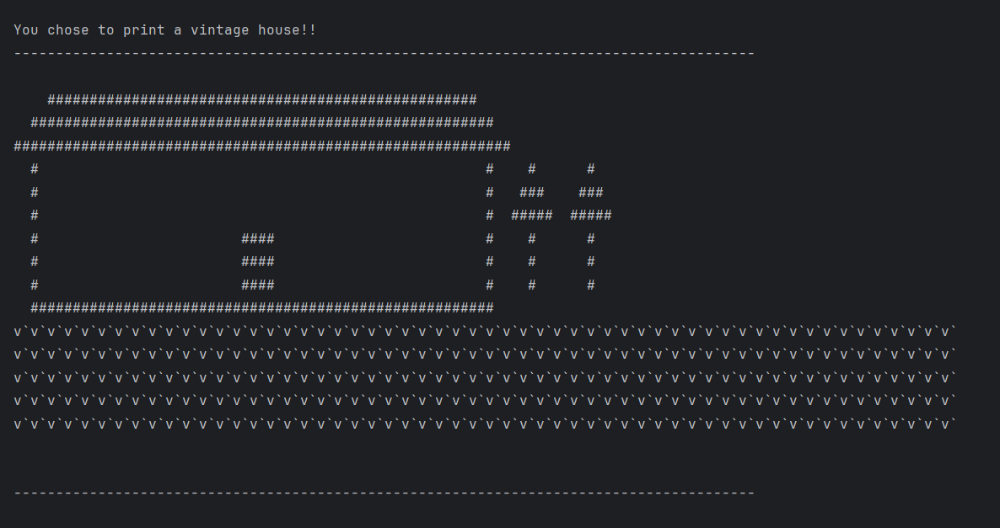

# ASCII Art Project 💻

Author: Ashmeet Kaur

This Java program allows the user to create various ASCII art shapes using a character of their choice.
The program supports different shapes like triangles, diamonds, rectangles, circles, and even a vintage home with trees and lawn.

---

## 📸 Screenshot


---

## Features ✨
- Triangle (odd/even sizes supported)
- Diamond (odd/even sizes supported)
- Rectangle
- Circle (approximate ASCII circle)
- Vintage Home with trees and lawn

---

## Input 🛠️
- Enter your input in the format [shape],[size],[character] when prompted.
- **Input Format:** 
  ```bash
  [shapeName],[size],[asciiChar]
- **shapeName:** triangle, diamond, rectangle, circle, or home
- **size:** positive integer representing size of shape
- **asciiChar:** single character used to draw the shape
- Example input:
diamond,7,*